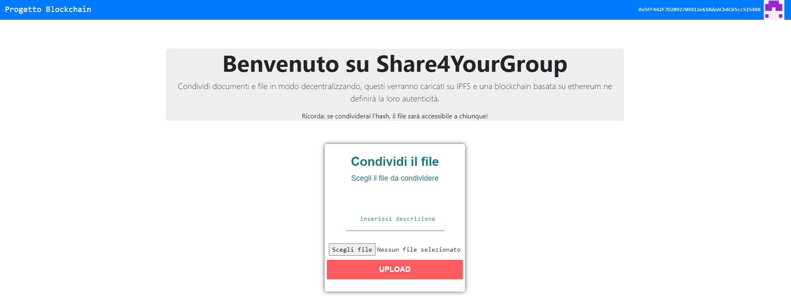

<p align="center">

</p>


# SHARE FOR YOUR GROUP DAPP


## Features

  - [X] Built for Ethereum using [Web3](https://github.com/ethereum/web3.js/).
  - [X] [IPFS](http://github.com/ipfs).   
  - [X] Reactjs mobile & desktop responsive UX.

## Setup

1. Install Dependencies

    ```sh
    $ npm install
    ```

2. Migrate blockchain 

    ```sh
    $ truffle migrate
    ```
3. Run the project

    ```sh
    $ npm run start
    ```

    Browser will launch on [http://localhost:3000/](http://localhost:3000/).
